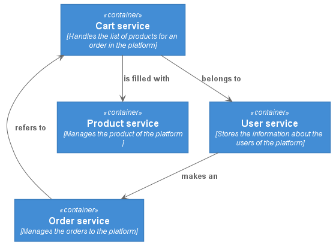
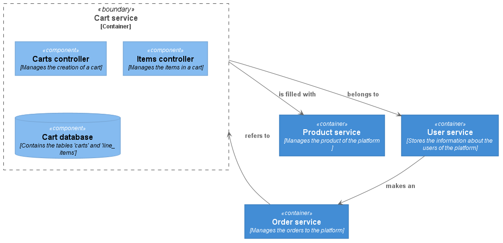

Architecture
============
A microservice migration from a monolith architecture is a process that involves
isolating individual features of the monolith into different services. It also
implies to separate and store the data that the service makes use, if not we
would be talking about a distributed monolith which is an anti-pattern. Once the
migration is completed, the same monolith migrated to a microservices
architecture could like the following schema.

For our task, given that we know which functionalities we want to
isolate (see [description of the
problem](./description/cart_microservice_problem.md)), we need to find which
tables are affected. The tables `cart` and `line_item` are chosen as they relate
to the features mentioned and they are intrinsically related.

As we are extracting these tables, we need to drop the references to foreign
keys as they become part of other domains. They will turn into weak references
that are not enforced by the database but for the business logic. We still keep
the foreign key relationships between the tables. At the end, the tables for our
new database will look like the following [schema](../config/service-schema.sql).

API design
----------
A modern design of a microservice should start with a OpenAPI first. This
document is a contract that we offer to the consumer to inform how our API will
behave. At the same time, we will use the specification to guide our
implementation.

The implementation can be found in the [OpenAPI file](../api/swagger.yml), and
it can be easily rendered using the official [Swagger Editor](https://editor.swagger.io/)

The design contains the following endpoints:

- **POST /cart**: Creates a new cart for the user.
- **GET /cart/{cardID}**: Returns the current state of the cart.
- **POST /cart/{cartID}/item**: Adds a new item to the cart.
- **DELETE /cart/{cartID}/item**: Empties the cart.
- **PUT /cart/{cartID}/item/{itemID}**: Modifies the item (ie. add more units).
- **DELETE /cart/{cartID}/item/{itemID}**: Removes the item from the cart.
